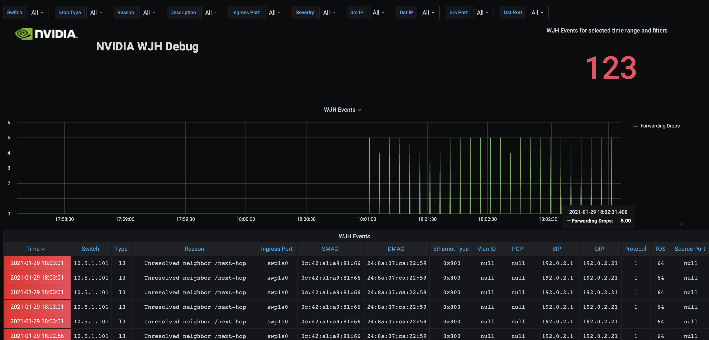

Per-event packet trap streaming using eBPF
================================

`trapstream` is performing per-event streaming for each packet
trap in JSON or native InfluxDB to external collector (e.g. Telegraf).
It uses eBPF for efficient packet dissection and flow-based traps
aggregation with simple python front-end for event streaming.

Usage
-----

After [installing `BCC`][1], run:

```
$ ./trapstream.py -i <send_interval> -b <batch_size> -d <local_ip> -f <json|influx> -u <unique_aggregation_interval> <collector_ip> <collector_port>
```

It will export metrics such as the below to some external collector:

**JSON:**
```json
[{
    "deviceIP": "10.5.1.101",
    "ingressPort": "swp1s0",
    "description": "Validate ARP table for the neighbor/next hop",
    "severity": "Warning",
    "dropType": "l3",
    "dropReason": "Unresolved  neighbor /next-hop",
    "timestamp": "1611931294.0104816",
    "message": "fwdDrop",
    "packet": {
        "packetType": "IP",
        "ETHERNET": {
            "etherTypeName": "0x800",
            "etherType": 2048,
            "srcMac": "0c:42:a1:a9:81:66",
            "dstMac": "24:8a:07:ca:22:59",
            "vlanId": 0,
            "pcp": 0
        },
        "IP": {
            "srcIp": "192.0.2.1",
            "dstIp": "192.0.2.21",
            "protocol": 1,
            "protocolName": "1 (icmp)",
            "length": 21504,
            "tos": 64,
            "ttl": 0
        }
    }
}]
```

**InfluxDB line protocol:**
```
DroppedPackets,description=Validate\ ARP\ table\ for\ the\ neighbor/next\ hop,deviceIP=10.5.1.101,dropReason=Unresolved\ \ neighbor\ /next-hop,dropType=l3,ingressPort=swp1s0,message=fwdDrop,packet_ethernet_dstMac=24:8a:07:ca:22:59,packet_ethernet_srcMac=0c:42:a1:a9:81:66,packet_ip_srcIp=192.0.2.1,packet_packetType=ip,severity=Warning packet_ethernet_etherType=2048i,packet_ethernet_etherTypeName="0x800",packet_ip_dstIp="192.0.2.21",packet_ip_length=21504i,packet_ip_protocol=1i,packet_ip_protocolName="1 (icmp)",packet_ip_tos=64i,packet_ip_ttl=0i,timestamp="1611931481.9788456" 1611931486216173312
```

[Telegraf][2] and [Grafana][3] can then be used to collect and visualize the information:



Details
-------

The per-{flow, trap} information is obtained by attaching an eBPF
program to the `devlink_trap_report` raw tracepoint in the kernel. 
The program dissects incoming packets and push out flow information with 
trap reason via a perf ring buffer to user-space. In case unique 
flow aggregation is enabled, it also stores number of packets received 
in a LRU hash table keyed by flow information and trap reason to 
aggregate them before sending to user space (this can lower the overhead
of per-event processing). 
This information is then formatted in the user space and streamed to external
collector in JSON or InfluxDB Line protocol format.

By default, the size of the LRU hash table is 1,024 entries. In case the
table overflows, it will be flushed. It is possible to change the size
of the hash table by modifying the configuration file.

Kernel 5.10 and above with `devlink_trap_report` raw tracepoint support 
is required to run `trapstream`.

[1]: https://github.com/iovisor/bcc/blob/master/INSTALL.md
[2]: https://www.influxdata.com/time-series-platform/telegraf/
[3]: https://grafana.com/
